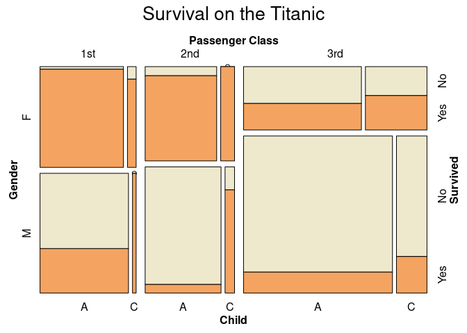

Survival on the Titanic
================
by XEM Team

## Summary

The Titanic, said to be “unsinkable”, collided with an iceberg and sank
on April 1942, killing 1502 out of 2224 passengers and crew. This was
one of the first accidents of this scale with important data about it
which was used to then improve maritime safety by passing new policies,
better safety procedures and construction to avoid another catastrophe.

We have decided to analyse original data from the accident and explore
how different attributes of passengers are related to their survival in
the catastrophe. These attributes include gender, age and socio-economic
status (represente by passenger class). We also looked at a range of
other variables including ticket price and port of embarkation.

We then moved on to build a logistic regression model to try and predict
survival based on these attributes. We focused on making our
parsimonious and saw that the explanatory variables which allow for the
model with better predicted performance are indeed gender, age and
passenger class.

One of the first visualizations to ever be created with data from the
Titanic is a graph by graphic artist G. Bron published on the Sphere
(British newspaper) one week after the accident. His work is an early
innovation in data display where each subgroup shown by a bar with area
proportional to the numbers of cases which today can be seen as an early
mosaic plot. We indeed decided to work on our own mosaic plot to display
the different factors related to survival in a single plot.

## Presentation

Our presentation can be found [here](presentation/presentation.html).

## Data

Include a citation for your data here. See
<http://libraryguides.vu.edu.au/c.php?g=386501&p=4347840> for guidance
on proper citation for datasets. If you got your data off the web, make
sure to note the retrieval date.

## References

List any references here. You should, at a minimum, list your data
source.
