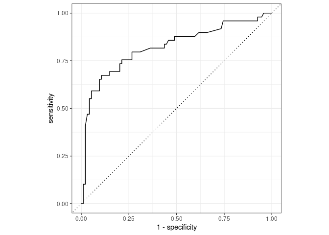

Project proposal
================
XEM Team

turning survived into factor variable

``` r
titanic <- titanic %>%
  mutate(Survived = factor(Survived))
```

``` r
titanic_age_na <- titanic %>%
  filter(!is.na(Age))
```

splitting data

``` r
set.seed(1116)
titanic_split <- initial_split(titanic_age_na, prop = 0.80)
train_data <- training(titanic_split)
test_data  <- testing(titanic_split)
```

build recipe

``` r
titanic_rec <- recipe(Survived ~ ., data = titanic) %>%
  # PassengerId isn't predictor, but keep around to ID
  update_role(PassengerId, new_role = "ID") %>%
  # remove name and cabin
  step_rm(Name, Ticket, Cabin) %>%
  # remove NAs for step cut to work
  step_filter(!is.na(Age)) %>%
  # discretise age variable
  step_cut(Age, breaks = c(0, 6, 18, 54)) %>%
  # make dummy variables 
  step_dummy(all_nominal(), -all_outcomes()) %>%
  # remove zero variance predictors
  step_zv(all_predictors())
```

define model

``` r
titanic_mod <- logistic_reg() %>% 
  set_engine("glm")
```

define workflow

``` r
titanic_wflow <- workflow() %>% 
  add_model(titanic_mod) %>% 
  add_recipe(titanic_rec)
```

fit model to training data

``` r
titanic_fit <- titanic_wflow %>% 
  fit(data = train_data)
tidy(titanic_fit)
```

    ## # A tibble: 12 × 5
    ##    term          estimate std.error statistic  p.value
    ##    <chr>            <dbl>     <dbl>     <dbl>    <dbl>
    ##  1 (Intercept)   19.0     602.         0.0316 9.75e- 1
    ##  2 Pclass        -1.13      0.178     -6.37   1.94e-10
    ##  3 SibSp         -0.543     0.163     -3.33   8.77e- 4
    ##  4 Parch         -0.292     0.161     -1.82   6.94e- 2
    ##  5 Fare           0.00270   0.00296    0.911  3.62e- 1
    ##  6 Sex_male      -2.94      0.270    -10.9    1.50e-27
    ##  7 Age_X.6.18.   -2.72      0.649     -4.19   2.84e- 5
    ##  8 Age_X.18.54.  -2.84      0.592     -4.80   1.55e- 6
    ##  9 Age_X.54.80.  -4.07      0.776     -5.25   1.56e- 7
    ## 10 Embarked_C   -11.7     602.        -0.0194 9.84e- 1
    ## 11 Embarked_Q   -12.3     602.        -0.0203 9.84e- 1
    ## 12 Embarked_S   -12.2     602.        -0.0202 9.84e- 1

predict test data

``` r
 titanic_pred <-predict(titanic_fit, test_data, type = "prob") %>%
  bind_cols(test_data %>% select(Survived, PassengerId)) 
titanic_pred
```

    ## # A tibble: 143 × 4
    ##    .pred_0 .pred_1 Survived PassengerId
    ##      <dbl>   <dbl> <fct>          <int>
    ##  1   0.475  0.525  0                  7
    ##  2   0.908  0.0923 0                 13
    ##  3   0.358  0.642  1                 16
    ##  4   0.783  0.217  1                 26
    ##  5   0.609  0.391  0                 36
    ##  6   0.217  0.783  0                 42
    ##  7   0.435  0.565  0                 50
    ##  8   0.215  0.785  1                 54
    ##  9   0.862  0.138  0                 58
    ## 10   0.759  0.241  0                 71
    ## # … with 133 more rows

roc curve

``` r
titanic_pred %>%
  roc_curve(truth = Survived, .pred_1, event_level = "second") %>%
  autoplot()
```

<!-- -->

cutoff probability

``` r
cutoff_prob <- 0.6
cutoff_table <- titanic_pred %>%
  mutate(
    Survived      = if_else(Survived == 1, "Survived", "Not survived"),
    titanic_pred  = if_else(.pred_1 > cutoff_prob, "Predicted to survive", "predicted not to survive")
    ) %>%
  count(titanic_pred, Survived) %>%
  pivot_wider(names_from = Survived, values_from = n) %>%
  kable(col.names = c("", "Not Survived", "Survived"))
```
