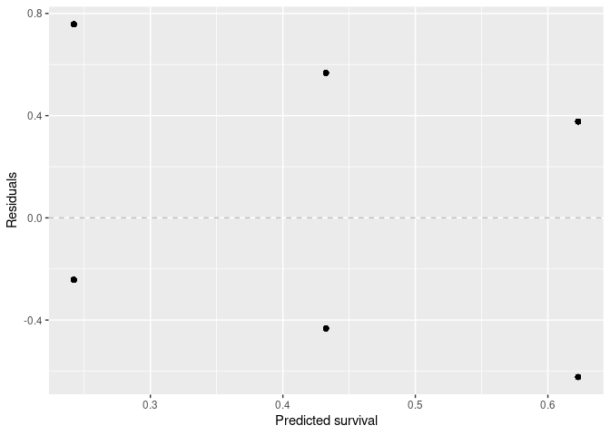

Project proposal
================
XEM Team

splitting data

``` r
set.seed(1116)
titanic_split <- initial_split(titanic, prop = 0.80)
train_data <- training(titanic_split)
test_data  <- testing(titanic_split)

glimpse(train_data)
```

    ## Rows: 712
    ## Columns: 12
    ## $ PassengerId <int> 460, 491, 790, 220, 621, 553, 17, 468, 490, 69, 558, 674, …
    ## $ Survived    <int> 0, 0, 0, 0, 0, 0, 0, 0, 1, 1, 0, 1, 0, 0, 0, 0, 1, 0, 1, 1…
    ## $ Pclass      <int> 3, 3, 1, 2, 3, 3, 3, 1, 3, 3, 1, 2, 3, 3, 2, 2, 1, 3, 2, 1…
    ## $ Name        <chr> "O'Connor, Mr. Maurice", "Hagland, Mr. Konrad Mathias Reie…
    ## $ Sex         <chr> "male", "male", "male", "male", "male", "male", "male", "m…
    ## $ Age         <dbl> NA, NA, 46.00, 30.00, 27.00, NA, 2.00, 56.00, 9.00, 17.00,…
    ## $ SibSp       <int> 0, 1, 0, 0, 1, 0, 4, 0, 1, 4, 0, 0, 0, 0, 2, 0, 0, 0, 1, 0…
    ## $ Parch       <int> 0, 0, 0, 0, 0, 0, 1, 0, 1, 2, 0, 0, 0, 0, 0, 0, 1, 0, 1, 2…
    ## $ Ticket      <chr> "371060", "65304", "PC 17593", "W/C 14208", "2659", "33097…
    ## $ Fare        <dbl> 7.7500, 19.9667, 79.2000, 10.5000, 14.4542, 7.8292, 29.125…
    ## $ Cabin       <chr> "", "", "B82 B84", "", "", "", "", "", "", "", "", "", "",…
    ## $ Embarked    <chr> "Q", "S", "C", "S", "C", "Q", "Q", "S", "S", "S", "C", "S"…

models

``` r
linear_reg() %>%
  set_engine("lm") %>%
  fit(Survived ~ Pclass, data = train_data) %>%
  tidy()
```

    ## # A tibble: 2 × 5
    ##   term        estimate std.error statistic  p.value
    ##   <chr>          <dbl>     <dbl>     <dbl>    <dbl>
    ## 1 (Intercept)    0.813    0.0509     16.0  2.23e-49
    ## 2 Pclass        -0.190    0.0206     -9.24 2.86e-19

``` r
surv_pclass_fit <- linear_reg() %>%
  set_engine("lm") %>%
  fit(Survived ~ Pclass, data = train_data)

surv_pclass_fit_aug <- augment(surv_pclass_fit$fit)

ggplot(surv_pclass_fit_aug, mapping = aes(x = .fitted, y = .resid)) +
  geom_point(alpha = 0.5) +
  geom_hline(yintercept = 0, color = "gray", lty = "dashed") +
  labs(x = "Predicted survival", y = "Residuals")
```

<!-- -->
