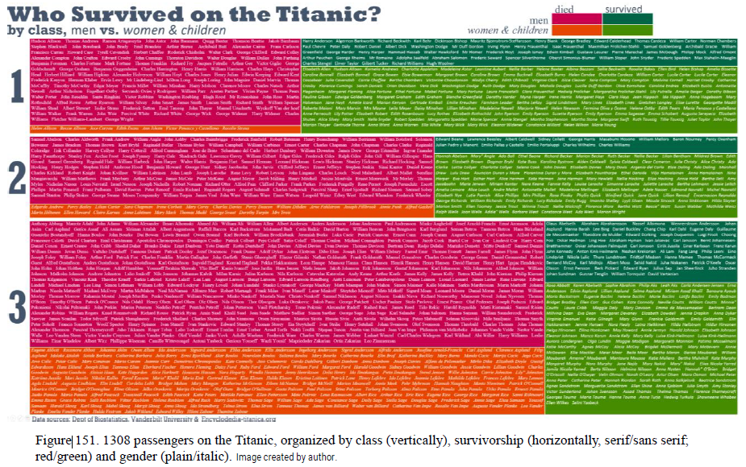

```{r load-packages, include = FALSE}
# Add any additional packages you need to this chunk
library(tidyverse)
library(broom)
library(here)
library(tidymodels)
library(knitr)
library(xaringanthemer)
library(dplyr)
library(vcd)
library(grid)
library(rsample)
library(ggplot2)
library(ggpol)
library(scales)
library(caret)
library(corrplot)
library(ggridges)
library(forcats)
library(scales)
library(skimr)
library(tidypredict)
library(kableExtra)
library(pscl)
```

```{r setup, include=FALSE}
# For better figure resolution
knitr::opts_chunk$set(fig.retina = 3, dpi = 300, fig.width = 6, fig.asp = 0.618, out.width = "80%")
```

```{r load-data, include=FALSE}
titanic <- read.csv(here::here("data/titanic.csv"))
glimpse(titanic)
```

```{r presentation-layout, include=FALSE}
style_xaringan(
  title_slide_background_image = "img/titanicpic.jpg" , title_slide_text_color = "ghostwhite" , background_color = "wheat2 " , text_color = "gray28"
)
```
```
#Table of Contents
- Background information
- Introduction to data set
- Data analysis
  - Gender vs. Survival
  - Age vs. Survival
  - Class vs. Survival
- Modelling
- Recreation of historic plot
- Bibliography

---
"Touted as the ultimate in transatlantic travel and said to be “unsinkable”, the Titanic collided with an iceberg on 14 April 1912 on her maiden voyage and sank shortly thereafter on 15 April, killing 1502 out of 2224 passengers and crew." [1]

We want to see 

### If and how the chance of survival of Titanic passengers is related to different attributes of the passengers 

---
# Data set
* The data set comes from the Awesome Public Data Sets on GitHub[2]

* There are 12 variables and 891 observations in this data set. 
.pull-left[
- `Name`: Name and Surname of passenger, if available 
- `Survived`: If passenger survived (0 = No, 1 = Yes)
- `Sex`: Gender of passenger (male or female)
- `Age`: Age in years
- `Pclass`: Passenger class (1 = 1st, 2 = 2nd, 3 = 3rd) 
- `Fare`: Passenger fare (i.e. cost of ticket in USD)
- `Embarked`: Port of embarkation (C = Cherbourg, Q = Queenstown, S = Southampton)[3] ]

---
class: inverse, middle, center
# Gender and Survival

---

# Introduction
* During the times when the sinking of the Titanic accident occurred (1912), in the spirit of chivalry women (and children) were saved first. This was historically recorded as orders from the captain of the Titanic.

---

# Visualization
.pull-left[
- Use gender as the predictor variable and frequency displayed in terms of colors showing survivals or not as the outcome variable
]

.pull-right[
```{r gender-survival,out.width="100%", fig.width=4, echo=FALSE}
titanic$Survived <- as.factor(titanic$Survived)
titanic$Pclass <- as.factor(titanic$Pclass)

titanic %>%
  ggplot(mapping = aes(x = Sex, fill = Survived)) +
  geom_bar() +
  theme_minimal() +
  scale_fill_viridis_d(name = "Survived", labels = c("No", "Yes" )) +
  labs(x = "Sex", 
       y = "Frequency", 
       title = "Survival Rate by Gender") +
  theme(legend.position = "bottom")
```
]


---
# Summary
.pull-left[
- The proportion of women passengers who survived is 0.68 
- The proportion of men passengers who survived is 0.32
]
.pull-right[
```{r survival_rate_gender,  fig.width=4, echo = FALSE}
titanic %>%
  filter(Survived == "1") %>%
  count( Sex ) %>%
  mutate(prop_survival = n/sum(n))
```
]
---
class: inverse, middle, center
# Age and Survival
---
# Introduction
- give priority to saving infants and children when it comes to providing life saving equipment

- physical abilities
---
# Data analysis 
.pull-left[
```{r age-survival,out.width="100%", fig.width=4, echo=FALSE, warning=FALSE}
titanic %>% 
  ggplot(mapping = aes(x = Age, fill = Survived)) +
  geom_histogram(binwidth = 5 ) +
  theme_minimal() +
  scale_fill_viridis_d(name = "Survived", labels = c("No", "Yes")) +
  labs(x = "Age", 
       y = "Frequency", 
       fill = "Survived", 
       title = "Survival rate by age") +
  theme(legend.position = "bottom")
```
]
---
class: inverse, middle, center
# Class/ Port/ Fare vs Survival

---

The class of the passenger can be considered to be a measure of their socio-economic status: based on our knowledge on the Titanic disaster we expect to find that the higher the class of the passenger, the higher their survival rate.

```{r class-survival ,echo=FALSE}
titanic %>%
  group_by(Pclass) %>%
  count(Survived) %>%
  mutate(pct = n/sum(n)*100) %>%
  mutate(pctrounded = round(pct, 2)) %>%
  ggplot(aes(x = Pclass , y = pctrounded ,  fill = Survived)) +
  geom_bar( position = position_stack(), stat = "identity", width = .7) +
  geom_text(aes(y = pct, label = pctrounded) ,position = position_stack(vjust  = 0.5), size = 3.5 ) +
  labs(x = "Class" , 
       y = "Probability of Survival" , 
       fill = "Survival", 
       title = "Survival for each Class") +
  theme_minimal()+
  theme(plot.background = element_rect(fill = "wheat")) +
   scale_fill_manual(values = c("0" = "navajowhite3",
                               "1" = "tan3"))
```

---
```{r fare-survival , echo=FALSE}
titanic %>%
  ggplot(aes(x=Pclass , y=Fare )) +
  geom_boxplot(outlier.shape = NA ) +
  geom_jitter(width = 0.2 , alpha = 0.2, size = 0.3) +
  coord_cartesian(ylim = c(0,300))+
  theme_minimal()
```

---
```{r , echo=FALSE}

  titanic_correlation <- titanic %>%
  select( Survived , Pclass , Fare) %>%
  mutate(Pclass_rank=if_else( Pclass == "3" , TRUE == "1"|
                              Pclass == "2" , TRUE == "2"|
                              Pclass == "1" , TRUE == "3"))
titanic_correlation$Pclass <- as.numeric(titanic_correlation$Pclass)
titanic_correlation$Pclass_rank <- as.numeric(titanic_correlation$Pclass_rank) 
titanic_correlation$Survived <- as.numeric(titanic_correlation$Survived)
```


```{r, echo=FALSE}

titanic_correlation_numeric <- titanic_correlation %>%
  select( Survived , Pclass_rank ,Fare)

titanic_correlation_numeric$Pclass_rank <- as.numeric(titanic_correlation_numeric$Pclass_rank)
  titanic_correlation_numeric$Survived <- as.numeric(titanic_correlation_numeric$Survived)
```


```{r , echo=FALSE}
corrplot2 <- function(titanic_correlation_numeric,
                      method = "pearson",
                      sig.level = 0.05,
                      order = "original",
                      diag = FALSE,
                      type = "upper",
                      tl.srt = 90,
                      number.font = 1,
                      number.cex = 1,
                      mar = c(0, 0, 0, 0)) {
  library(corrplot)
  titanic_correlation_numeric_incomplete <- titanic_correlation_numeric
  titanic_correlation_numeric <- titanic_correlation_numeric[complete.cases(titanic_correlation_numeric), ]
  mat <- cor(titanic_correlation_numeric, method = method)
  cor.mtest <- function(mat, method) {
    mat <- as.matrix(mat)
    n <- ncol(mat)
    p.mat <- matrix(NA, n, n)
    diag(p.mat) <- 0
    for (i in 1:(n - 1)) {
      for (j in (i + 1):n) {
        tmp <- cor.test(mat[, i], mat[, j], method = method)
        p.mat[i, j] <- p.mat[j, i] <- tmp$p.value
      }
    }
    colnames(p.mat) <- rownames(p.mat) <- colnames(mat)
    p.mat
  }
  p.mat <- cor.mtest(titanic_correlation_numeric, method = method)
  col <- colorRampPalette(c("#BB4444", "#EE9988", "#FFFFFF", "#77AADD", "#4477AA"))
  corrplot(mat,
    method = "color", col = col(200), number.font = number.font,
    mar = mar, number.cex = number.cex,
    type = type, order = order,
    addCoef.col = "black", # add correlation coefficient
    tl.col = "black", tl.srt = tl.srt, # rotation of text labels
    # combine with significance level
    p.mat = p.mat, sig.level = sig.level, insig = "blank",
    # hide correlation coefficiens on the diagonal
    diag = diag
  )
}
titanic_correlation_numeric %>%
corrplot2( 
  method = "pearson",
  sig.level = 0.05,
  order = "original",
  diag = FALSE,
  type = "upper",
  tl.srt = 75)
```

---
```{r , echo=FALSE}
 titanic %>%
filter( Embarked == "Q" | Embarked == "S" |Embarked == "C" ) %>%
group_by(Embarked) %>%
  count(Pclass) %>%
  mutate(pct = n/sum(n)*100) %>%
  mutate(pctrounded = round(pct, 2)) %>%
  ggplot(aes(x = Embarked , y = pctrounded ,  fill = Pclass)) +
  geom_bar( position = position_dodge(), stat = "identity", width = .7 )
```
---

```{r , echo=FALSE}
titanic %>%
filter( Embarked == "Q" | Embarked == "S" |Embarked == "C" ) %>%
group_by(Embarked) %>%
  count(Survived) %>%
  mutate(pct = n/sum(n)*100) %>%
  mutate(pctrounded = round(pct, 2)) %>%
    ggplot(aes(x = Embarked , y = pctrounded ,  fill = Survived)) +
  geom_bar( position = position_stack(), stat = "identity", width = .7 ) +
  geom_text(aes(y = pct, label = pctrounded) ,position = position_stack(vjust = 0.5), size = 3.5 ) 
```
```
--- 
class: inverse, center, middle

# Predictive model for survival on the titanic

---
```{r factor-variables, include=FALSE}
titanicm <- titanic %>%
  mutate(Survived = factor(Survived)) %>%
  mutate(Pclass = factor(Pclass)) 
```
```{r remove-age-na, include=FALSE}
titanic_age_na <- titanicm %>%
  filter(!is.na(Age))
```
```{r titanic-splitting, include=FALSE}
set.seed(1116)
titanic_split <- initial_split(titanic_age_na, prop = 0.80)
train_data <- training(titanic_split)
test_data  <- testing(titanic_split)
```
``` {r titanic-recipe, include=FALSE}
titanic_rec <- recipe(Survived ~ ., data = titanicm) %>%
  # PassengerId isn't predictor, but keep around to ID
  update_role(PassengerId, new_role = "ID") %>%
  # remove name and cabin
  step_rm(Name, Ticket, Cabin, SibSp, Parch, Fare, Embarked) %>%
  # remove NAs for step cut to work
  step_filter(!is.na(Age)) %>%
  # discretise age variable
  step_cut(Age, breaks = c(0, 6, 18, 54)) %>%
  # make dummy variables 
  step_dummy(all_nominal(), -all_outcomes()) %>%
  # remove zero variance predictors
  step_zv(all_predictors())
```
```{r titanic-model, include=FALSE}
titanic_mod <- logistic_reg() %>% 
  set_engine("glm")
```
```{r titanic-workflow, include=FALSE}
titanic_wflow <- workflow() %>% 
add_model(titanic_mod) %>% 
add_recipe(titanic_rec)
```
---
### Aim of the model 
fitting a binary logistic regression machine learning model using tidymodels library
testing the trained model’s prediction (model evaluation) strength on the unseen/test data set using various evaluation metrics.
+ usefulness of models they did on 
---
### Modelling Survival
+ **predictor/explanatory variables**:
  + Age
  + Passenger class
  + Gender
+ **ID variable**: passenger ID
+ **response variable**: survival
  + categorical, two levels ...
{{content}}
--
$\rightarrow$ **logistic regression modelling**
--
```{r titanic-fit-to-train, include=FALSE}
titanic_fit <- titanic_wflow %>% 
  fit(data = train_data)
```

```{r titanic-fit-to-train-display, echo=FALSE}
tidy(titanic_fit) %>%
kbl() %>%
  kable_styling(bootstrap_options = c("striped", "hover"), full_width = F )
```
---
.pull-left[
### Modelling Survival: Interpretation
Note: using main effects (vs. interactions) $\rightarrow$ results can still be interpreted with 3 explanatory variables. 
**Intercept**: 
> Positive intercept: female, first class passenger, aged 0-6 is expected to survive.
]

.pull-right[
```{r ref.label="titanic-fit-to-train-display", echo=FALSE}
```
]

**Coefficents** for *Class*: 
> All else held constant, second class passengers correspond to a negative coefficent which reflects a lower likelyhood of survival compared to first class passengers.

+ Similarly, third class passengers have an even more negative gradient which indicates that the model predicts them to have an even lower likelyhood of survival. 

**Coefficent** for *Gender*:
> All else held constant, male passengers correspond to a negative coefficent which reflects a lower likelyhood of survival compared to female passengers.

**Coefficents** for *Age*: 
> All else held constant, compared to passengers aged 0-6 ('young children'), passengers in age range from 6 to 18 ('adolescents')are expected to be less likely to survive. 

+ similarly, passengers aged 18 to 54 ('adults') are also less likely to survive (similar gradeint to 6-18)
+ passengers aged 54 to 80 ('elderly people') are even less likely to survive than the other age ranges
---
```{r titanic-predict-test-data, include=FALSE}
titanic_pred <-predict(titanic_fit, test_data, type = "prob") %>%
  bind_cols(test_data %>% select(Survived, PassengerId)) 
titanic_pred
```

### A look at what the model predicts
.pull-right-narrow[
<font size="40">
🔍
</font>
]
.pull-left-wide[

```{r titanic-predict-test-data-table, echo=FALSE}
sample_n(titanic_pred, 10) %>%
  select(.pred_1, Survived, PassengerId) %>%
  knitr::kable(
    col.names = c("Probability to survive", "Survived", "Passenger ID"), 
    align = rep('c', 5), 
    digits = 3
    ) %>%
  kable_styling(bootstrap_options = c("striped", "hover"), position='center', full_width = F)
```
]

---
###Evaluating the model: Sensitivity and specificity
.pull-left[
``` {r titanic-roc-curve, fig.height = 200, echo=FALSE}
titanic_pred %>%
  roc_curve(truth = Survived, .pred_1, event_level = "second") %>%
  autoplot()
```
]
.pull-right[
```{r sensitivity-specificity-prob, echo=FALSE}
cutoff_prob <- 0.6
titanic_pred %>%
  mutate(
    Survived      = if_else(Survived == 1, "Survived", "Not survived"),
    survived_pred  = if_else(.pred_1 > cutoff_prob, "Predicted to survive", "predicted not to survive")
    ) %>%
  count(survived_pred, Survived) %>%
  pivot_wider(names_from = Survived, values_from = n) %>%
  kable(col.names = c("", "Not Survived", "Survived"))
```
]
---
###Evaluating the model: Statistical tests
.pull-left[
```{r prep-for-statistic-tests, include=FALSE}
titanic_results <- titanic_pred %>%
  mutate(
    survived = if_else(Survived == 1, "yes", "no"),
    survived_pred = if_else(.pred_1 > cutoff_prob, "yes", "no")
    ) %>%
  select(survived, survived_pred) 
```

``` {r statistic-tests, echo = FALSE}
custom_metrics <- metric_set(sens, spec, kap, mcc)
custom_metrics(titanic_results, 
               truth = as.factor(survived), 
               estimate = as.factor(survived_pred)) %>%
  kbl() %>%
  kable_styling(bootstrap_options = c("striped", "hover"), position="center", full_width = F )

```
]

.pull-right[

**Sensitivity** $=TP/(FN+TP)$

{{content}}
]
--
**Specificity** $=TN/(FP+TN)$

{{content}}
--
**Kappa** $\in[-1,1]$  
How much better the model is over the random classifier. (here moderate agreement)

{{content}}
--
**Matthews Correlation Coefficient (MCC)** $\in[-1,1]$  
Produces high score if the prediction obtained good results in TP, FN, TN, FP, proportionally to the size of positive elements and the size of negative elements in the dataset. (here moderate agreement)
---


class: inverse, center, middle

# Recreating G. Bron's "Sphere" Diagram

---
## G. Bron's original Diagram on "the Sphere", 1912
.left-column[
```{r Gbron-original-chart, echo = FALSE, out.width = "120%", fig.align = "right", fig.cap = "G.Bron's chart of 'The Loss of the Titanic', 4 May 1912." }
include_graphics("https://www.researchgate.net/profile/Michael-Friendly/publication/330916468/figure/fig1/AS:723679168196613@1549549967751/GBrons-chart-of-The-Loss-of-the-Titanic-from-The-Sphere-4-May-1912-Each-subgroup.png")
```
]
.right-column[
+ The Sphere: popular British illustrated weekly newspaper (1900-1964). It was dedicated to worldwide reporting on popular issues. 
{{content}}
]
--
+ G. Bron, graphic artist, used data released the week before by the House of Commons for the visualisation pubblished on 4 May 1912, **three weeks after the Titanic disaster**
{{content}}
--
+  Bron’s graph is an early innovation in data display:
{{content}}
--
    + each subgroup is shown by a bar whose area is proportional to the numbers of cases
{{content}}   
--
    + Within the passenger classes, the bars are subdivided by gender for adults, while children are shown as a separate group. 
{{content}}
--
    + It also includes summary panels, showing the totals for passengers and crew.
{{content}}
--
+  Today, we might describe this as an early form of a mosaic plot, or as an area-proportional back-to-back array of bar charts
---

``` {r table-mosaic, echo=FALSE, results = 'hide'}
titanic_child <- titanic %>%
  mutate(ischild = ifelse(Age >= 18, "adult", "child"))
  
tbl <- xtabs(~Survived + Pclass + Sex + ischild, titanic_child)
ftable(tbl)
```

``` {r mosaic plot, echo = FALSE, fig.align = 'center'}
mosaic(~ Survived + Pclass + Sex + ischild, data = titanic_child, 
       highlighting = "Survived", highlighting_fill = c("#727272", "#79c36a"),
       labeling_args = list(set_varnames = c(Sex = "Gender",
                                             Survived = "Survived",
                                             Pclass = "Passenger Class",
                                             ischild = "Child")),
        set_labels = list(Survived = c("No", "Yes"),
                          Pclass = c("1st", "2nd", "3rd", "Crew"),
                          Sex = c("F", "M"),
                          ischild = c("A","C")),
       main = "Survival on the Titanic")
```


---
## Aside

.pull-left[
Brath (2018) created mosaic plots filling the tiles with the names of the victims and survivors among the 1308 passengers. 

> This highlights the fact that the passengers were people, not statistics. It's common to overlook on this while handling data that has to do with casualties.

* This is also an example of how typography could be used in data visualization.
]

.pull-right[
```{r brath2018-plot, echo=FALSE, out.width = '100%'}

```
]

.footnote[
Brath, Richard. 2018. “Text in Visualization: Extending the Visualization Design Space.” PhD thesis, London South Bank University.
]

---
#Bibliography
[1] Source: Friendly, M., Symanzik, J., &amp; Onder, O. (2019, February 6). Royal Statistical Society Publications. Royal Statistical Society. Retrieved November 19, 2021, from https://rss.onlinelibrary.wiley.com/doi/full/10.1111/j.1740-9713.2019.01229.x. 

https://rkabacoff.github.io/datavis/Models.html#Mosaic 


https://www.datavis.ca/papers/titanic/

https://www.datavis.ca/papers/titanic/ 

[2] https://github.com/awesomedata/awesome-public-datasets

[3] https://www.kaggle.com/c/titanic/data

