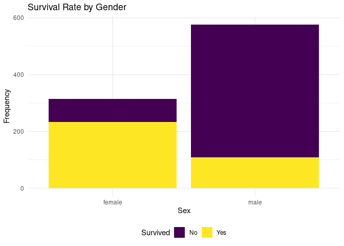

Project proposal
================
XEM Team

## 1. Introduction

Touted as the ultimate in transatlantic travel and said to be
“unsinkable”, the Titanic collided with an iceberg on 14 April 1912 on
her maiden voyage and sank shortly thereafter on 15 April, killing 1502
out of 2224 passengers and crew.
<https://rss.onlinelibrary.wiley.com/doi/full/10.1111/j.1740-9713.2019.01229.x>
We want to see **if and how the chance of survival of Titanic passengers
is related to different attributes of the passengers including sex, age,
socio-economic status etc.** – this is the general research question of
our project.

The data set we have used have comes from the Awesome Public Data Sets
on GitHub (<https://github.com/awesomedata/awesome-public-datasets>) and
there is no information on where the data originated or how it was
collected. However, we have found an article on a similar data set so we
have reason to believe that *“the primary sources of data on the Titanic
derive from official inquiries launched in Britain and the USA. Shortly
after the disaster, the British Parliament authorised the British Board
of Trade Inquiry with Lord Mersey as chair. The committee interviewed
over 100 witnesses over 36 days of hearings. Their report, issued on 30
July 1912, contained extensive tables of passengers and crew, broken
down by age group, gender, class and survival”*
<https://rss.onlinelibrary.wiley.com/doi/full/10.1111/j.1740-9713.2019.01229.x>

The titanic.csv file contains data for 887 of the real Titanic
passengers (2208 total). Each row represents on passenger and there are
12 different columns which describe different attributes about the
person including whether they survived, their age, their
passenger-class, their sex and the fare they paid.
<https://web.stanford.edu/class/archive/cs/cs109/cs109.1166/problem12.html>

## 2. Data

    ## Rows: 891
    ## Columns: 12
    ## $ PassengerId <int> 1, 2, 3, 4, 5, 6, 7, 8, 9, 10, 11, 12, 13, 14, 15, 16, 17,…
    ## $ Survived    <int> 0, 1, 1, 1, 0, 0, 0, 0, 1, 1, 1, 1, 0, 0, 0, 1, 0, 1, 0, 1…
    ## $ Pclass      <int> 3, 1, 3, 1, 3, 3, 1, 3, 3, 2, 3, 1, 3, 3, 3, 2, 3, 2, 3, 3…
    ## $ Name        <chr> "Braund, Mr. Owen Harris", "Cumings, Mrs. John Bradley (Fl…
    ## $ Sex         <chr> "male", "female", "female", "female", "male", "male", "mal…
    ## $ Age         <dbl> 22, 38, 26, 35, 35, NA, 54, 2, 27, 14, 4, 58, 20, 39, 14, …
    ## $ SibSp       <int> 1, 1, 0, 1, 0, 0, 0, 3, 0, 1, 1, 0, 0, 1, 0, 0, 4, 0, 1, 0…
    ## $ Parch       <int> 0, 0, 0, 0, 0, 0, 0, 1, 2, 0, 1, 0, 0, 5, 0, 0, 1, 0, 0, 0…
    ## $ Ticket      <chr> "A/5 21171", "PC 17599", "STON/O2. 3101282", "113803", "37…
    ## $ Fare        <dbl> 7.2500, 71.2833, 7.9250, 53.1000, 8.0500, 8.4583, 51.8625,…
    ## $ Cabin       <chr> "", "C85", "", "C123", "", "", "E46", "", "", "", "G6", "C…
    ## $ Embarked    <chr> "S", "C", "S", "S", "S", "Q", "S", "S", "S", "C", "S", "S"…

There are 12 variables in the data set.

-   **Numerical variables**: discrete: `PassengerID`, `Age`, `SibSp`,
    `Parch`, `Ticket`, `Cabin`, and continuous: `Fare`.

-   **Categorical variables**: ordinal: `Pclass`, and not: `Survived`,
    `Name`, `Sex`, `Embarked`.

A full description of these variables as well as some notes are all
included in the in the `README` in the `\data` folder, which includes
the dimensions and codebook for the dataset. The source for these is:
<https://www.kaggle.com/c/titanic/data>.

## 3. Data analysis plan

#### Hypothesis 1: Women have a higher survival rate than men.

We assume that men were helping women while the tragic of Titanic was
taking place, since this is a habitual behavior of men to give priority
to women. In order to confirm if this is true we will create a bar plot
using gender as the predictor variable and frequency displayed in terms
of colors showing survivals or not as the outcome variable. Moreover, we
will calculate the survival rate by gender.See the summary statistics
below: filtering by the passengers who survived , we can see that the
proportion of women passengers who survived is as high as 0.68 and the
proportion of men passengers who survived is almost half of the women’s
(approximately 0.32).Since the variables that we will be using are
categorical , an appropriate statistical method to verify our hypothesis
is the Chi-Square test as it will show whether gender and survival are
independent or not of one another.

<!-- -->

    ##      Sex   n prop_survival
    ## 1 female 233     0.6812865
    ## 2   male 109     0.3187135

#### Hypothesis 2: The younger survivals are more than the older survivals .

The age of a passenger can be considered to be high priority. We take it
for granted that people give priority to saving infants and young
children when it comes to providing life saving equipment.Beyond that
the survival of passengers is highly related to their physical abilities
which means that the younger the passenger is the higher possibility is
to survive.A possible way to visualize the data it is to use a histogram
using “Age” as the predictor variable(X) and “Frequency” as the outcome
variable(Y) displayed in terms of colors showing survivals or not. This
type of graph will point out the Age with the highest number of
survivals. Since the dataset provides a number of values for ages, we
will have to create a new variable called “Age\_Range” which groups the
ages by scale of 10, that is 0-10, 11-20 etc so that we can find the
survival rate for each age range and come out with more concrete
conclusions.See the summary statistics below: filtering by the
passengers who survived, we can see that the proportion of passengers
aged between 21-30 years old have the highest probability to survive
with 0.246.A statistical method that is useful to answer our hypothesis
is to create a box plot including all the ages so that we can conclude
which ages have highest possibility to survive as it displays the median
as well as interquartile range , excluding outliers / extreme values.

    ## Warning: Removed 177 rows containing non-finite values (stat_bin).

<!-- -->

    ##   Age_Range  n prop_survival
    ## 1      0-10 38   0.111111111
    ## 2     11-20 44   0.128654971
    ## 3     21-30 84   0.245614035
    ## 4     31-40 69   0.201754386
    ## 5     41-50 33   0.096491228
    ## 6     51-60 17   0.049707602
    ## 7     61-70  4   0.011695906
    ## 8     71-80  1   0.002923977
    ## 9      <NA> 52   0.152046784

#### Hypothesis 3: The higher the class of the passenger, the higher survival rate.

The class of the passenger can be considered to be a measure of their
socio-economic status: based on our knowledge on the Titanic disaster we
expect to find that the higher the class of the passenger, the higher
their survival rate. Moreover, we expect the ticket price (`fare`
variable) to follow a similar relationship as it is very likely that the
ticket price and the class will have a linear relationship.See the
summary statistics below: filtering by the passengers who didn’t survive
, we can see that the proportion is as high as 0.68 in 3rd class
passengers and much lower for first and second class (approximately 0.15
and 0.18 respectively). Based on this , we can also predict that the
ticket price will have a positive linear relationship with the frequency
of survivals. A possible graph to display this relationship is the bar
plot having the class to be the predictor variable and the fare
displayed in terms of colors showing survivals or not as the outcome
variable .This supports our hypothesis as the people who bought an
expensive ticket in first class had a higher survival rate than those
who bought a cheap ticket in 2nd and 3rd class. A statistical method to
use in order to support our hypothesis is to display the regression line
on a scatter plot where fare is the predictor variable and survival rate
is the outcome variable to find out the regression constant so as to
figure out if there is a strong correlation between these two variables.

<!-- -->

    ##   Pclass   n prop_death
    ## 1      1  80  0.1457195
    ## 2      2  97  0.1766849
    ## 3      3 372  0.6775956

#### Visualising the data together – Recreating a G.Bron’s historic chart

Within our project, we would also like to recreate our version of
G.Bron’s chart of “The Loss of the ‘Titanic’”, from The Sphere, 4 May
1912 – first know data visualization on the topic. The plot clearly
shows the affect of all the different variables we have mentioned before
on the survival rate in a single data visualization. We could explore
unseen plot types and see which one can recreate similar results, as
well as a different visualization we believe better conveys the
information. One possible option is a mosaic plot, but we will need to
do more research to reach any conclusions.
